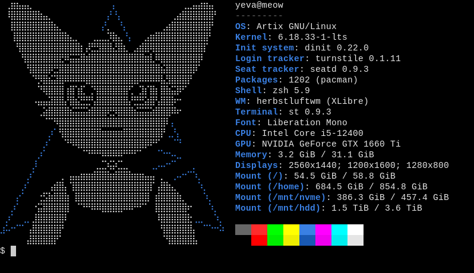

# [ divifetch ]

> *an anti-fetch script generator with mostly hard-coded values, dynamic modules and optimisations*



## >> WHAT? >>

divifetch is a build-time fetch script compiler.

it reads a simple config file and generates a C program that renders ASCII art with dynamic content from pluggable modules.

unlike other fetch scripts that parse configs and fork processes at every run, divifetch moves most of the work to compile time - producing a binary that's faster, smaller, and dependency-freer than any traditional fetch script could be.

## >> FEATURES >>

- everything is hard-coded and statically batched
- strict no dead code policy
- runtime dependency-free due to static linking
- easily extensible module system
- polyglot module support
- multi-config random selection
- Unicode and ANSI escape code support

## >> GETTING STARTED >>

```shell
# clone the repo:
git clone https://git.divio.city/me/divifetch.git
cd divifetch

# compile the generator:
cd src
make && cd ..

# generate, copy and edit the example config file:
./generator config -oc config.conf
vi config.conf

# generate the source code and Makefile:
./generator source make

# build the fetch script:
make
```

## >> SCREENSHOTS >>

can be found [here](screenshots/README.md)

## >> DOCUMENTATION >>

can be found [here](https://git.divio.city/me/divifetch/wiki)

## >> MOTIVATION >>

divifetch is inspired by [nofetch](https://github.com/0xCUB3/nofetch), the world's fastest fetch script ever made. according to its author:
> fetch scripts are dumb and overrated and are in every r/unixporn post

and i agree with him.

the concept of a "fetch script" itself is flawed - it implies that trying to optimize fetching large amounts of unnecessary information (which never or almost never changes) is going to make much performance difference.

one might try to circumvent this by hard-coding values into the config file, but even then the fetch script is still reading a useless config file and assembling every module/entry on the file.

unfortunately for me, i do enjoy the aesthetic value that having something (including a fetch script) on shell startup brings. that led to me creating divifetch.

Mirrors:
[diviocity](https://git.divio.city/me/divifetch)
[disroot](https://git.disroot.org/diviocity/divifetch)
[codeberg](https://codeberg.org/diviocity/divifetch)
[git.gay](https://git.gay/diviocity/divifetch)
[gitea](https://gitea.com/diviocity/divifetch)
[rocketgit](https://rocketgit.com/user/diviocity/divifetch)
[salsa](https://salsa.debian.org/diviocity/divifetch)
[framagit](https://framagit.org/diviocity/divifetch)
[gitlab](https://gitlab.com/diiviocity/divifetch)
[github](https://github.com/diiviocity/divifetch)

